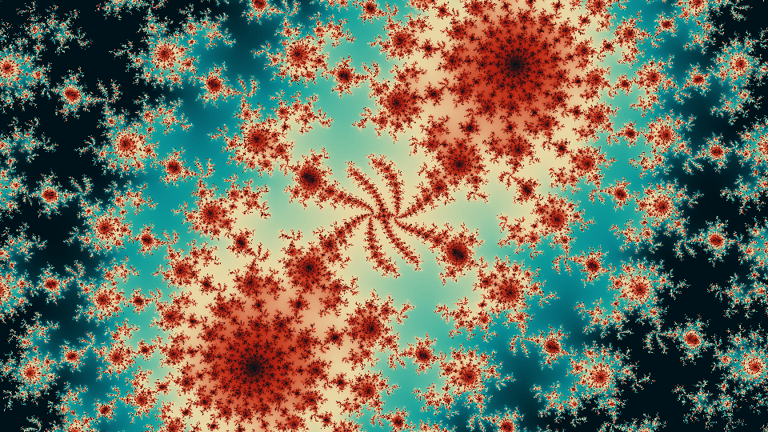
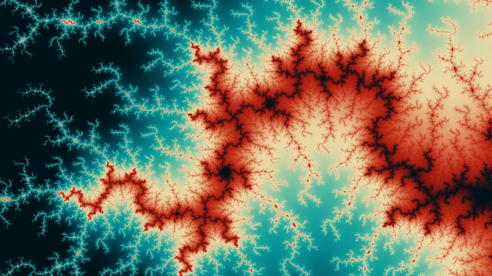

# mandelbrot

The [Mandelbrot Set](https://en.wikipedia.org/wiki/Mandelbrot_set) is a set of numbers {c in C} in the complex plane for which the value of the a simple function f_c(z) does not diverge when applied recurively to infinity, with z_0=0. Various [plotting algorithms](https://en.wikipedia.org/wiki/Plotting_algorithms_for_the_Mandelbrot_set) exist to transform a black-or-white image of the set (either a point is in the set, or it isn't) into a colour image. Most of these use the so-called escape count -- how quickly the [absolute value](https://en.wikipedia.org/wiki/Absolute_value#Complex_numbers) of each point escapes a certain arbitrary bound.


This script uses such an algorithm to plot the set with some customisability options, including but not limited to:
- The aspect ratio of the image
- The quality of the image
- The centre of the image in the plane
- How much of the plane is captured, i.e the zoom of the image
- The colour scheme (limited to a few options, but making one yourself is not difficult)

Please note that the script is not super efficient and so creating high-res images can take a while.

## Running the script
`mandelbrot.py` should be run from the command line using arguments. There are a few different ways to approach generating an image:
1. Specifying the coordinates *and* zoom through the use of `-c` or `--centre` and `-z` or `--zoom`, respectively. Points are formatted with a space between the real part and the imaginary part, e.g ```-c "-1 0"```.
2. Choosing a preset from configs.json with `-cs`, e.g `-cs tendril`. This will specify the zoom and centre implicitly. Examples of the images created with these presets can be found at the [bottom](#examples). You can create your own preset by specifying `-sc <name>` or `--save-config <name>`.
3. Running the script through either option 1. or 2. and specifying `-sd` or `--save-data`, subsequently calling the script with `-ld` or `--load-data`. This can be useful for plotting images in multiple palletes.

Other important command line arguments not already discussed above include:
- `-r, --resolution`: options include ultra, high, med, low. At aspect ratio 16:9 (the default), high renders an image in 1920x1080p.
- `-p, --pallete`: a choice of one of the palletes in `config.json`. Options include warm, neon, dark, electric, and pastel. Examples of each can be found at the [bottom](#examples).

Putting all this together, one configuration we might try is 

```python mandelbrot.py -cs void -p electric -r high -sd```

This would yield us the following image and save the escape counts to `data/`:


We might decide we don't like that colour pallete in this preset (we'd be wrong, but anyway) and rerun the script with 

```python mandelbrot.py -ld void.npy -p dark```

This would create the following image, and quite a lot more quickly since we circumvent a lot of calculation:


## Examples
| dark, capillary |  |
| dark, tilt |  |
| electric, squircle |  |
| electric, void |  |
| neon, tilt |  |
| pastel, divergence |  |
| pastel, splotches |  |
| pastel, void |  |
| warm, chloro |  |
| warm, classic |  |
| warm, doubletentacle |  |
| warm, knife |  |
| warm, tendril |  |
| warm, tentacle |  |